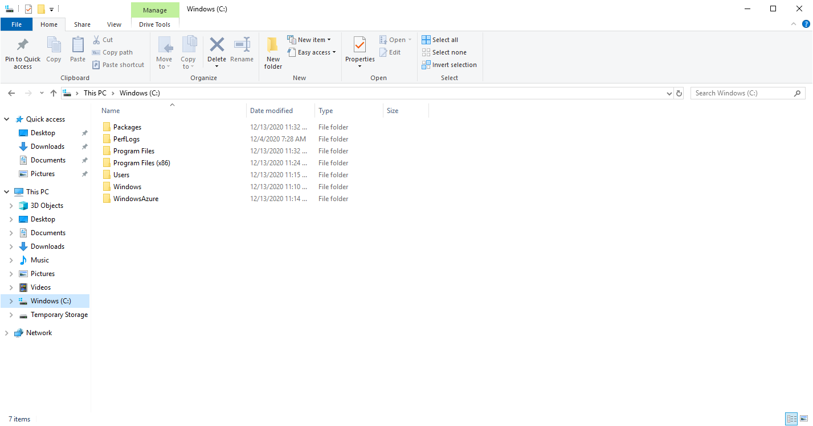
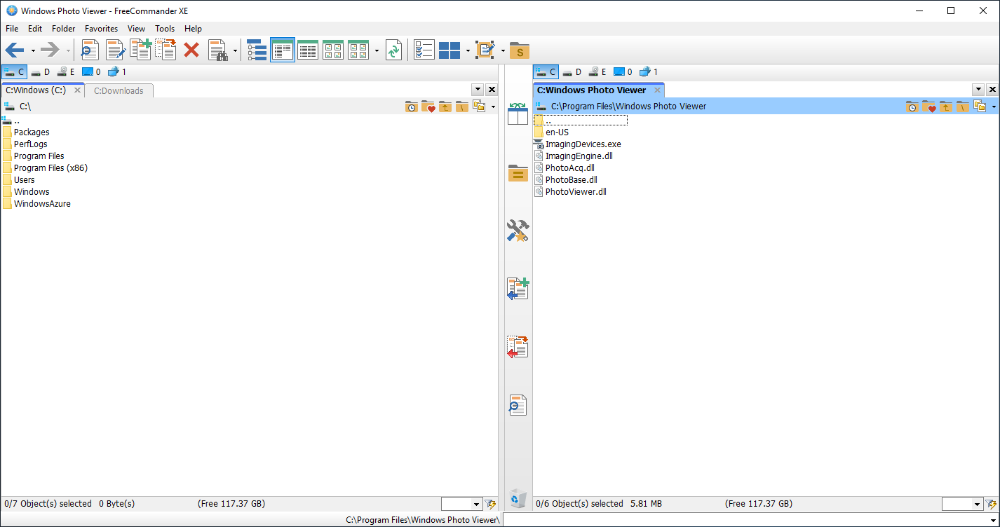
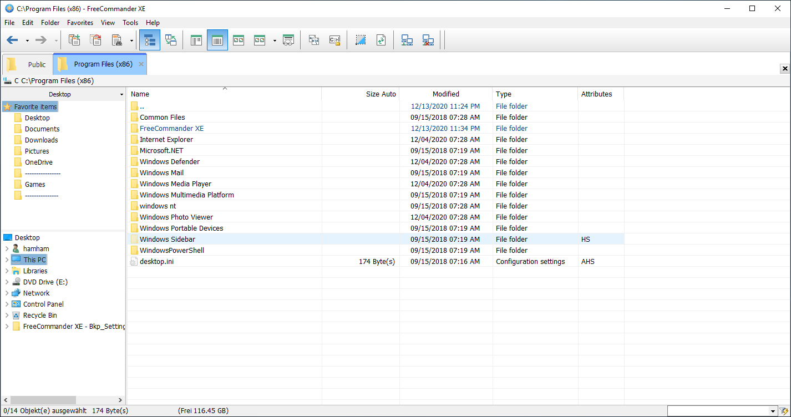
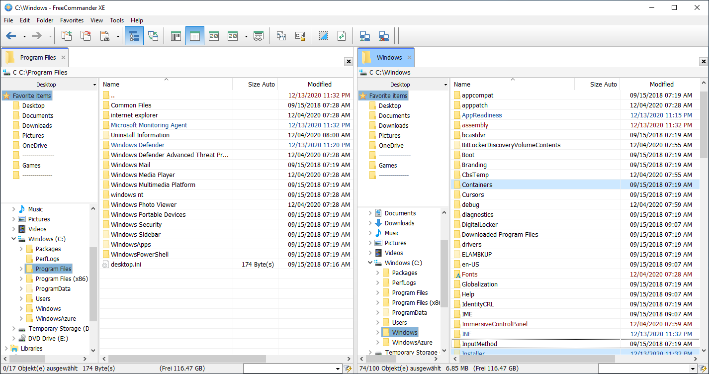
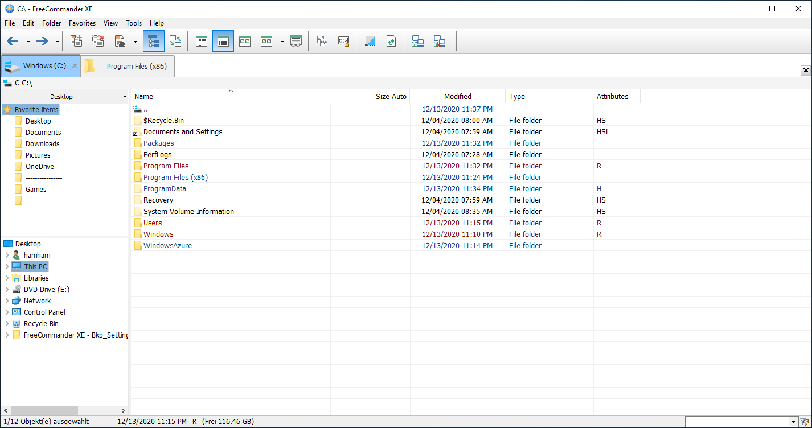
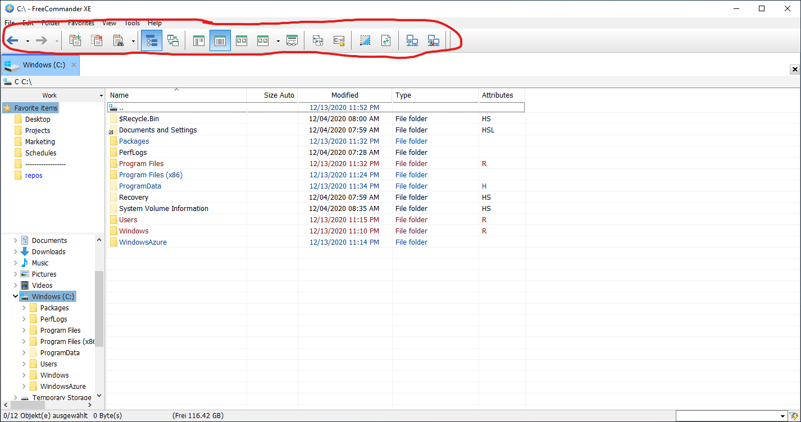
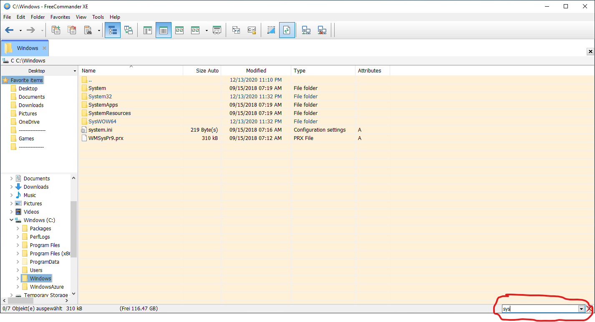
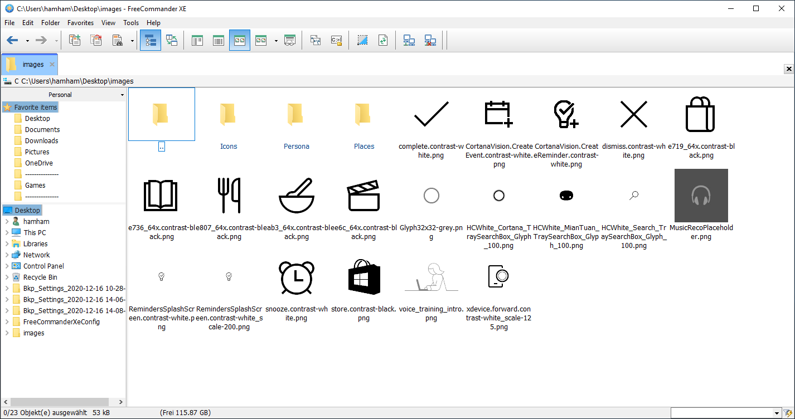
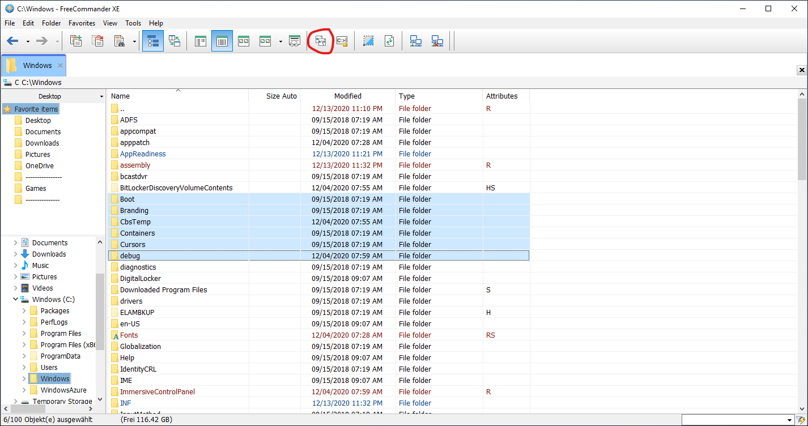
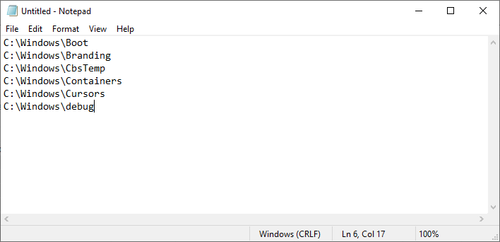

# FreeCommander XE Starter Configuration

## Motivation

For me, the features of the standard Windows Explorer are not sufficient. So I evaluated some alternative file explorers and stuck with [FreeCommander XE](https://freecommander.com/en/summary/). It's a great freeware and I can really recommend checking it out (see *Features* below).

>*But:* The interface and the sheer number of features can be overwhelming for new users. Without extensive customization in the settings, the default FreeCommander is quite bulky to use.

>*Solution:* I created an optimized starter pack configuration, which in my opinion addresses these challenges. The number of UI elements is reduced, further settings are streamlined.
This hopefully helps people to get a head start with this powerful file explorer.

**Screenshot Comparison**

Vanilla Windows Explorer | Vanilla FreeCommander | Customized FreeCommander Configuration
--- |--- |---
 |  | 
Lack of comfort features  | Cluttered UI and bulky default settings | Optimized settings for better user experience

----------

## Installation Instructions
1. Install [FreeCommander XE](https://freecommander.com/en/summary/).
1. Clone this git repository.
(For beginners: Click on the green "Code" button and then on `Download ZIP`. Unzip the downloaded folder.)
1. Open up FreeCommander. Go to `Tools / Restore all settings`. Select the cloned folder.
1. Confirm and wait for FreeCommander to restart.
1. Done!

> *Remark:* You have to update the links in the favorites section or create new ones yourself (right-click in the favorites section) 

> *Remark:* When you change settings, hit the `Tools / Save Settings` button. These are not saved automatically to reduce the closing time of the software. You can re-enable this in the settings if you want to.

> *Remark:* You can change the UI language under `Tools / Settings / General.`

----------

## Customized Features

I generally customized a lot of UI colors and margins. These are the bigger FreeCommander features I optimized:

Feature | Description | Shortcut | Screenshot
--- | --- | --- | ---
**Tabs**  | Use tabs instead of having to open multiple windows (similar to your browser). I edited the tab size and coloring to be easier recognizable.  | `New tab:` Double click on empty space right of a tab. `Restore tab:` Right-click in tab area an select `Recently closed...` |  
**Split View**  | Two parallel views for comparison use cases. Powerful feature, now easily accessible. | Press `Spacebar` to activate/deactivate |  
**Property-based file name colorizing**  | You can use any file property like date, size, type. My configuration colors *read-only* files & folders in red and *newly* created files in dark blue. This helps a lot in finding recently changed items.  | Done automatically. Editable under `Settings/View/File-Folder-List` |  
**Custom Action Toolbar**  | Fully customizable. I rearranged everything to better show relevant elements.  | Changeable with right-click on the `Action Toolbar`. |  
**Quick Filters**  | Easily pin down the one file you are looking for. Works in an instant. Capable of search expressions like logical ANDs. I enlarged the filter field to be more recognizable.  | See the documentation on the [FreeCommander Website](https://freecommander.com/fchelpxe/en/Quickfilter.html). |  
**Custom File Views**  | You can set what information is displayed in the file list. I edited a lot of smaller stuff here, like the column width. Also, I set up an *automatic change* from a list view to a thumbnail view, when more than half of the files in a folder are images.  | If you want to modify this, go to `Setting/View/Column Profiles`. |  
**Copy file paths to clipboard**  | You can select multiple files and get all their paths copied into the clipboard. Often handy in dev tasks.  | Just hit the marked button from the action bar. |   
**Fast parent folder navigation**  | *Small gem at the end:* You can double click on a free area in the file list to move up to the parent folder. You will miss this in Windows Explorer after 5 minutes of usage. I promise.  | `Double click on a folder:` Move hierarchy down. `Double click on a free area:` Move hierarchy up. |  

----------

## Further (untouched) Features

There are many more things FreeCommander is capable of doing:

* You can start command prompts from your current folder. I disabled the input field for this, as I use a different approach and wanted to save UI space.
* You can work with multiple "quick access" lists / favorite shortcuts. Handy, if you want to separate work folders from general folders.
* You can choose other color themes, like a dark mode. 
* FreeCommander is capable of doing diffs on two folders.
* FreeCommander has a built-in multi rename capability (not yet tested).
* FreeCommander has an actually useful search function, where you can fine-tune your parameters, e.g. search only files or folders, maximum file size and so on. Compare this to the current Windows 10 search.

----------

## Conclusion

FreeCommander might be a bit overwhelming at first because there are a lot of tweaks possible. 

In my opinion, it is worth the effort, though. This is due to two reasons: 

First, you probably locate files on your computer each day, so you do this process very often. Therefore it should be customized to your needs. 
Second, this is a rare effort, as you can save & backup your customizations.

*Happy exploring!*

