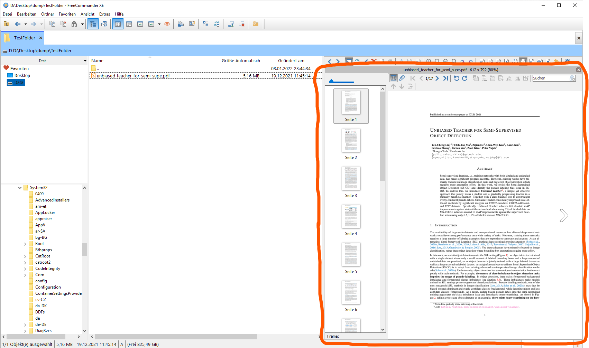
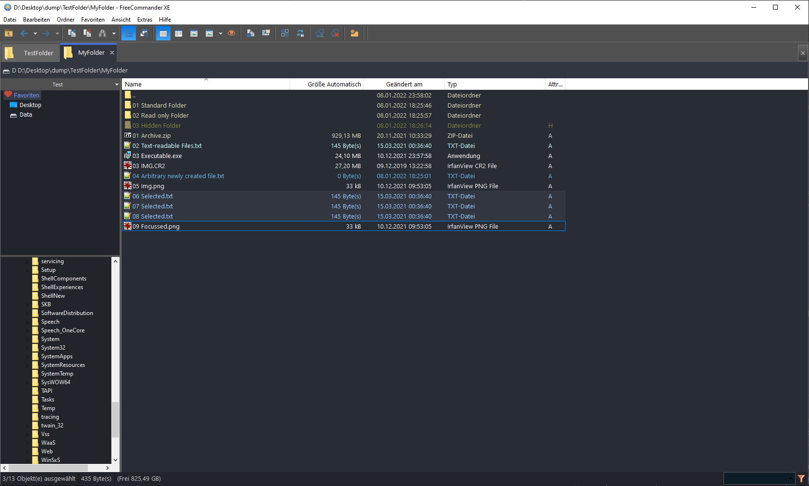

# FreeCommander XE Starter Configuration

Corresponding Medium.com article with further explanation: ["Working with Windows feels tedious?"](https://medium.com/nerd-today/working-with-windows-feels-tedious-690ebc3ce914)

## TL;DR

In this repo you can finding a custom configuration for the Windows File Explorer tool [FreeCommander XE](https://freecommander.com/en/summary/). It offers a lot of benefits in contrast to the standard Windows Explorer, but the user experience on the default UI is not optimal. So I tweaked it. Feel free to download and modify it to your liking.

### Updates

2022-01-08: Added custom color scheme: **Dark mode!**

## Movitation

For me, the features of the standard Windows Explorer are not sufficient. So I evaluated some alternative file explorers and stuck with [FreeCommander XE](https://freecommander.com/en/summary/). It's a great freeware and I can really recommend checking it out (see *Features* below).

>*But:* The interface and the sheer number of features can be overwhelming for new users. Without extensive customization in the settings, the default FreeCommander is quite bulky to use.

>*Solution:* I created an optimized starter pack configuration, which in my opinion addresses these challenges. The number of UI elements is reduced, further settings are streamlined.
This hopefully helps people to get a head start with this powerful file explorer.

**Screenshot Comparison**

 Vanilla FreeCommander UI | Customized FreeCommander Configuration (this)
--- |---
 | 
Cluttered UI and bulky default settings | Optimized settings for better user experience

----------

## Installation Instructions
1. Install [FreeCommander XE](https://freecommander.com/en/summary/).
1. Clone this git repository.
(For beginners: Click on the green "Code" button and then on `Download ZIP`. Unzip the downloaded folder.)
1. Open up FreeCommander. Go to `Tools / Restore all settings`. Select the cloned folder.
1. Confirm and wait for FreeCommander to restart.
1. Done!

**Remarks**
- You have to update the links in the *favorites section* or create new ones yourself (right-click in the favorites section) 

- When you change settings, hit the `Tools / Save Settings` button. These are not saved automatically to reduce the closing time of the software. You can re-enable this in the settings if you want to.

- You can change the UI language under `Tools / Settings / General.`

----------

## FreeCommanderXE Features and customizations

I generally customized a lot of UI colors and margins. Following some FreeCommanderXE features I edited:

Feature | Description | Shortcut | Screenshot
--- | --- | --- | ---
**Tabs**  | Use tabs instead of having to open multiple windows (similar to your browser). I edited the tab size and coloring to be easier recognizable.  | `New tab:` Double click on empty space right of a tab. `Restore tab:` Right-click in tab area an select `Recently closed...` |  
**Split View**  | Two parallel views for comparison use cases. Powerful feature, now easily accessible. | Press `Ctrl + Spacebar` to activate/deactivate |  
**Property-based file name colorizing**  | My configuration colors *read-only* files & folders in red and *recently* edited files in dark blue. This really usefull in finding recently changed items (believe me).  | Done automatically. Colors are editable under `Settings/View/File-Folder-List` |  
**Quick Filters**  | Easily pin down the one file you are looking for. Works in an instant. Capable of search expressions like logical ANDs.  | See the documentation on the [FreeCommander Website](https://freecommander.com/fchelpxe/en/Quickfilter.html). |  
**Custom Action Toolbar**  | I rearranged all the items and show only a small set of useful ones.  | Customizable with right-click on the `Action Toolbar`. |  
**File Quick View**  | You can preview files in a sperated area with the click of a button. I chose `spacebar` (like on MacOS). The quick viewer can display text files, pdfs, images, and much more. | Press `space` to open/close quick file view. | 
**Copy file paths to clipboard**  | You can select multiple files and get all their paths copied into the clipboard. Often handy in development tasks.  | Just hit the marked button from the action toolbar. |    
**Dark Mode (*new*)**  | I added a custom dark mode based on the colors of VS Studio Code. *Note*: Not all colors can be changed currently.  | Make sure you copied the `ColorSchemes` folder to your FreeCommanderXE installation location. Then change the schema via `View/Color Schemes/ Dark_Midnight_by_vii` |   
**Fast parent folder navigation**  | *Small gem at the end:* You can double click on a *free* area in the file list to move up to the parent folder. So basically inverse to double click on a folder. You will miss this in Windows Explorer after 5 minutes of usage. I promise.  | `Double click on a folder:` Move hierarchy down. `Double click on a free area:` Move hierarchy up. |  

----------

## Further Features of FreeCommanderXE

There are many more things FreeCommanderXE is capable of doing:

* You can start command prompts from your current folder. I disabled the input field for this, as I use a different approach (`Right click -> open PowerShell here`) and wanted to save UI space. You can reenable this, if you want to.
* You can work with multiple "quick access" lists / favorite shortcut list. This is handy, if you want to separate your work folders from personal folders.
* FreeCommanderXE has a very useful search function, where you can even fine-tune search parameters, e.g. search only for files or folders, set maximum file size and so on. Compare this to the Windows 10 search (not).
* FreeCommanderXE is capable of doing diffs on two folders.
* FreeCommanderXE has a built-in multi rename capability (not yet tested).

----------

## Questions

If you have questions just drop me a message. For further information I can recommend checking out the mentioned Medium article above.

*Happy exploring!*

